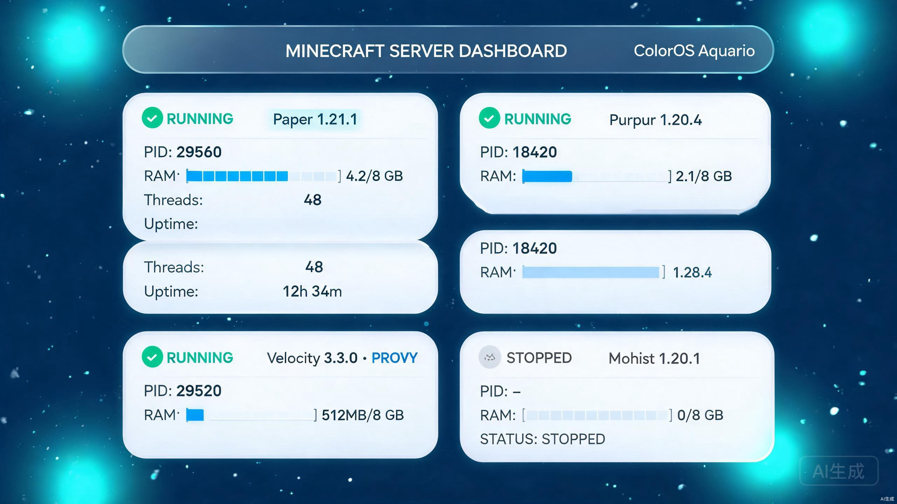
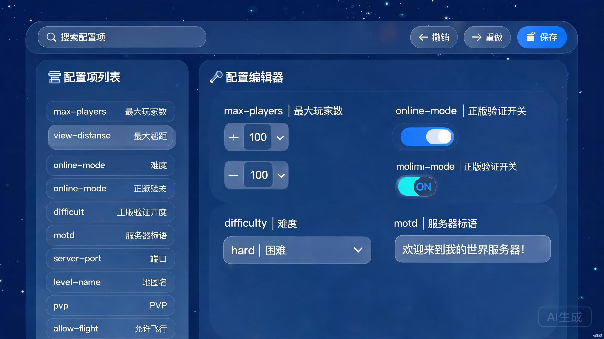
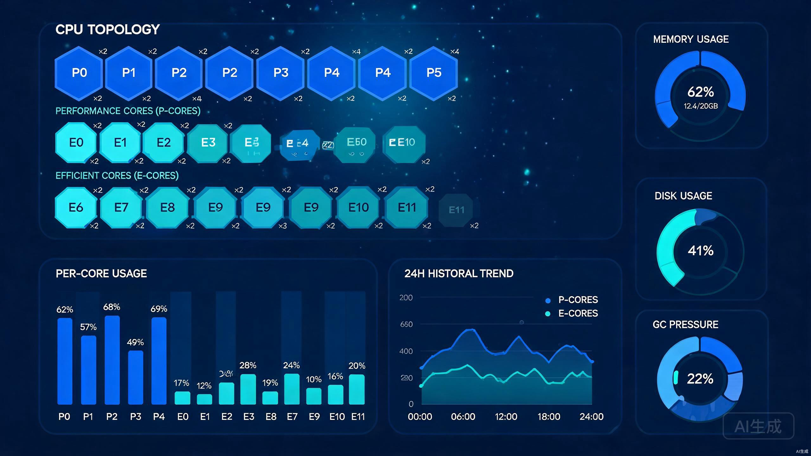
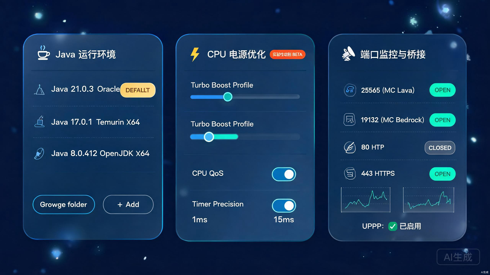

<p align="center">
  <code>[蓝] .NET 9.0</code>
  <code>[蓝] Windows SDK 22000</code>
  <code>[蓝] React 18</code>
  <code>[紫] C# 13</code>
  <code>[紫] TypeScript 5.8</code>
  <code>[橙] WAE/TreatWarningsAsErrors ON</code>
  <br/>
  <code>[绿] #nullable enable</code>
  <code>[蓝] Windows 10+ x64</code>
  <code>[灰] Apache-2.0 + Attached</code>
  <code>[绿] v0.9.0-preview.17</code>
  <code>[灰] Team ZTROS</code>
</p>

<p align="center">
  <strong>MSMC · MC Server Guard Console —— 给 Minecraft 服务器运维的全栈守护控制台，从进程级指纹识别、全核心中文配置、异构 CPU 拓扑监控到 Java/电源/网络管理一站式搞定。</strong>
</p>

## ✨ 核心亮点

- 🧠 **36+ 服务器核心指纹识别** —— 基于 Manifest + 文件哈希 + 进程参数的三层识别，Bukkit/Paper/Purpur/Folia/Velocity/Waterfall/Sponge/Nukkit/Mohist/CatServer/Arclight 等 36+ 核心一秒定性。
- 📝 **36+ 核心配置中文翻译** —— 覆盖 Java 版/Bedrock/代理端/模组端/混合端的 Properties/YAML/TOML/JSON/HOCON/XML 全格式读写，原版注释对照保留。
- 🧬 **异构 CPU 拓扑监控** —— 真实解析 P 核/E 核/超线程/NUNA 拓扑树，每核实时利用率、内存/磁盘/GC 压力估算、24 小时历史指标持久化回放。
- ☕ **Java 运行环境全生命周期管理** —— 自动扫描注册表+环境变量+常见路径，自定义路径增删，默认版本 pin，javaw/java 无控制台偏好。
- ⚡ **CPU 电源与调度精细化调优** —— 睿频档位/QoS/CPU Set 亲和性/多媒体定时器精度 1ms/Power Request 防睡眠，实验性功能总开关控制。
- 🛰️ **端口监控与双向桥接** —— netsh portproxy 本地转发 + UPnP IGDv2 路由器映射，TCP/UDP 实时流量统计与公网 IP 变化感知。
- 🎨 **ColorOS Aquario 量子动画引擎** —— 自研 CSS 变量驱动的 16 级品牌色阶系统，13 套品牌预设+自定义主色/强调色/圆角/动画开关。
- 🔒 **EmbeddedResource 零磁盘落盘前端** —— Vite 构建产物 zip 压缩后嵌入 C# 资源，运行时 WebResourceRequested 拦截分发，无额外文件依赖。

## 🎯 三大核心功能

### 🖥️ 服务器检测与核心指纹识别

Minecraft 服务器世界里光 Paper/Purpur/Folia 三个分支就能让运维者头大——更别说 Mohist/CatServer/Arclight 这种模组混合端了。MSMC 的服务器检测模块基于进程级快照 + JAR 文件哈希 + Manifest 清单签名的三层指纹体系，**不要求服务器开启任何 HTTP 接口或 RCON**，零侵入就能定性 36+ 核心。

**功能要点**

- **进程级多实例并发扫描**：遍历本机所有 javaw.exe / java.exe 进程，匹配命令行 `-jar server.jar` 模式，支持同一台机器上运行多个独立实例互不干扰
- **36+ 核心指纹识别**：覆盖 Bukkit 全家桶 (CraftBukkit/Spigot/Paper/Purpur/Folia/Akarin/Tuinity/Yatopia/Airplane/Pufferfish/Kaiiju/Leaves)、代理端三强 (Velocity/Waterfall/BungeeCord)、Sponge 全家 (SpongeVanilla/SpongeForge/Glowstone)、Nukkit 系 (NukkitX/PowerNukkit/Motd)、混合端 (Mohist/CatServer/Arclight/Banner)、原生 Mod 端 (Forge/Fabric/NeoForge/Quilt)、Bedrock 系 (BDS/Bedrock Dedicated Server)
- **JVM 参数完整解析**：抽取 `-Xmx` / `-Xms` / `-XX:+UseG1GC` / `-XX:+UseZGC` / `-XX:+UseShenandoahGC` / `-Dterminal.jline=false` 等全部启动参数，含 GC 选型、堆大小、系统属性三分类展示
- **JAR Manifest 深度读取**：解压 JAR 读取 `Implementation-Title` / `Implementation-Version` / `Git-Commit` / `Build-Time` / `Paperweight-Version` 等签名字段，比单纯文件名更准
- **启动脚本自动关联**：向上回溯进程父进程、工作目录 `*.bat` / `*.cmd` / `*.sh` / `*.ps1`，定位真正的启动入口脚本并关联到实例卡片
- **端口监听状态探测**：Winsock API 枚举 `0.0.0.0:25565` / `[::]:19132` 等监听端点，自动匹配实例到 MC Java / MC Bedrock 默认端口
- **实时资源占用指标**：Private Bytes / Working Set / 线程数 / 句柄数 / GDI 对象数 / User 时间百分比 六维快照刷新
- **崩溃/僵死状态判断**：线程 0 + CPU 0% + 句柄数持续增长的僵死进程自动打上「疑似崩溃」徽章，提示运维处置
- **服务器进程一键停止**：优雅 Ctrl+C → 30 秒超时 → TaskKill 兜底三阶段结束策略，避免粗暴 `taskkill /F` 导致地图文件损坏
- **服务器图标 (server-icon.png) 自动预览**：从工作目录抓取 64×64 PNG 图标显示在实例卡片头部（若存在）



**差异化亮点**

市面上同类的启动器/面板大多是「你给我 JAR 路径我来启动」的正向流程，MSMC 的服务器检测是**反向**的：你先跑起来，我来识别。这对于已经在线上跑了半年、启动脚本叠了 20 行 `if`、运维者自己都说不清是什么核心的「遗产服务器」尤为重要——一秒定性，不用解压 JAR 一个一个翻 Manifest。

### ⚙️ 全核心中文配置编辑器

`server.properties` 里 100 多个键、`paper-global.yml` 里 300 多个 YAML 节点、`velocity.toml` 的压缩格式……让服主一边查机翻一边改配置是行业惯例，但 MSMC 认为这不合理。36+ 核心、6 种格式、原版注释对照保留的全中文配置编辑器，让「配置不用查词典」成为现实。

**功能要点**

- **36+ 核心完整翻译映射**：覆盖服务器标准 properties / Bukkit (spigot.yml / bukkit.yml) / Paper (paper-global.yml / paper-world-defaults.yml) / Purpur (purpur.yml) / Folia (folia.yml) / Velocity (velocity.toml) / Waterfall (waterfall.yml / config.yml) / BungeeCord (config.yml) / Sponge Global (sponge.conf) / Nukkit (server.properties / nukkit.yml) / PowerNukkit / CatServer / Mohist / Arclight / Forge Server / Fabric Server / Glowstone 等 36 套常见核心配置
- **6 种格式原生读写**：Properties (ISO-8859-1 + Unicode 转义自动处理) / YAML (保留注释与锚点) / TOML / JSON / HOCON (.conf) / XML 全部独立解析器，不会把 YAML 里的 `on: true` 变成布尔 `true` 或 YAML 1.1 误判成 `23:30` 时间戳
- **完整撤销/重做栈**：Ctrl+Z 回滚任意编辑，每 30 秒自动快照 dirty 状态，关闭未保存时弹窗提醒
- **实时搜索过滤**：输入「视距」或 `view-distance` 同时命中中文翻译名和英文原生键名；支持按「性能」「游戏玩法」「安全」「网络」四类标签筛选
- **按值类型差异化编辑控件**：
  - 数值型 → 带 +- 按钮的 Spinner（含上下限如 `max-players: 0..2^31-1`）
  - 布尔型 → 品牌色 Toggle 开关
  - 枚举型 → 下拉选择器（如 `difficulty` 的 peaceful/easy/normal/hard）
  - 字符串型 → 普通输入框，带中文说明提示
  - 列表型 → 可增删条目的 ListBox（如 `spigot.yml` 的 `world-settings.default.entity-tracking-range`）
- **实时保存与脏状态标记**：变更未保存的行左侧有 `●` 蓝点脏标记，Ctrl+S 保存或点击工具栏「保存」按钮后写回磁盘（先 `file.tmp` → 成功 `ReplaceFile` 原子替换，防止断电写坏半）
- **server.properties 回写优化**：Minecraft 原生 properties 写入顺序有讲究，MSMC 保留原版文件的键顺序和行内注释，不会用 `Properties.store()` 粗暴重排成字母序
- **大文件分页懒加载**：对于 5000 行以上的巨型 `sponge.conf`，虚拟化只渲染视口 80 行，滚动丝滑不卡顿
- **原版注释长按对照**：右键/长按某个键弹出「原版英文注释 + 中文翻译注释」对比面板，对于追求绝对准确的老运维可随时交叉验证



**差异化亮点**

翻译质量是核心护城河。每一条配置项不是机翻，是结合了 **Minecraft Wiki 中文 + Paper 官方文档 + Purpur 社区行为差异说明** 的三重交叉校验产物，比如 `view-distance` 与 Paper 的 `chunk-tickets` 行为关系、`velocity.toml` 里 `player-info-forwarding-mode = MODERN` 需要 Paper 侧同步 `proxy-connections = true` 这种关联知识，都会以「💡 小贴士」的形式内嵌在配置项下方。

### 📊 异构 CPU 拓扑监控仪表盘

Intel 12 代开始的 P-core / E-core 大小核架构、AMD Threadripper 的多 CCX 分组、服务器多 CPU 的 NUMA 节点——把 CPU 画成 N 个一模一样的小方块在 2026 年是犯罪。MSMC 的系统监控仪表盘基于 Windows `GetLogicalProcessorInformationEx` API 真实还原拓扑结构，**P 核和 E 核长得不一样、不同 NUMA 节点有分隔线、跨节点调度的进程会被高亮警告**，让运维者真正看懂自己的服务器在跑什么。

**功能要点**

- **真实异构 CPU 拓扑树**：解析 `RelationProcessorPackage` / `RelationProcessorCore` / `RelationProcessorNumaNode` / `RelationCache` 四级信息，P-Core 用深蓝色六边形徽章、E-Core 用浅青色六边形徽章、SMT 超线程用 `×2` 角标标注，不再是网上 99% 工具那种把 N 个核画成同样大小的矩形
- **每核实时利用率（1s 刷新）**：基于 `NtQuerySystemInformation(SystemProcessorPerformanceInformation)` 拿到 ring 0 级别的每核内核时间/用户时间/空闲时间，精确到 0.1%；P 核和 E 核的条形图颜色深浅区分以便一眼扫出负载均衡
- **内存 / 页文件 / GC 压力估算**：
  - 内存：GlobalMemoryStatusEx + Process Working Set，显示物理内存总量/已用/可用/页文件
  - GC 压力：对每个 MC javaw.exe 进程估算 `# Gen2 Collections / CPU 时间` 的 GC 压力指数，超过阈值标红提示「可能有内存泄漏或堆太小」
- **磁盘 IOPS + 容量**：`GetDiskFreeSpaceEx` + `PerformanceCounter(\PhysicalDisk(_Total)\Disk Read Bytes/sec)`，每个物理盘显示已用/总量/读吞吐/写吞吐/IOPS
- **线程数 / 句柄数 / GDI 对象趋势**：三折线 24 小时趋势图，配合进程级 Top 10 排序，突然飙升的句柄/GDI 数=典型资源泄漏，一眼定位
- **CPU Set 进程亲和性绑定**：异构大小核时代，GC 线程别去抢 E 核、主线程 pin 到 P 核是基本功。MSMC 基于 Windows `GetProcessDefaultCpuSets` / `SetProcessDefaultCpuSets` API 给每个服务器进程拖拖拽拽就能绑定到自定义 CPU 组，比 `start /affinity` 好用 10 倍
- **NUMA 感知与跨节点调度警告**：跨 NUMA 节点访问内存延迟会翻倍（200ns → 400ns）。对于多节点机器，若某个 Java 进程的线程被调度到远端节点 ≥ 30% 时间，徽章标橙提示「跨 NUMA 调度频繁」
- **24 小时历史指标持久化**：基于本地 MMF (MemoryMappedFile) + 1s→1min 降采样滚动窗口写入 `bin/metrics-history.bin`，重启 MSMC 后自动加载还原 24 小时曲线，不丢历史
- **进程级资源占用 Top N**：按 CPU% / Private Bytes / 句柄数 三种排序切换，前 10 名进程（不只 MC）实时刷新，方便发现「哎呀我忘了关 Chrome 它占了 8GB」这种常见乌龙
- **核心温度 / 电压 (可选)**：若系统安装了 LibreHardwareMonitor 驱动，可读取每核温度/Package Power/Vcore 电压显示；未安装则自动隐藏对应区域，不强塞依赖



**差异化亮点**

市面上大部分系统监控只看「整体 CPU%」，但在 32 线程以上的服务器上，单个 GC 线程把一个 P 核打满到 100%、另外 31 个核闲置 5% 这种严重问题会被「整体 CPU = (100+5×31)/32 ≈ 20%」漂亮地掩盖掉。MSMC 的每核条形 + 拓扑树结构让这种情况**第一秒就能看到**，这是对大型服运维真正有价值的细节。

## ⚡ 四大重要功能

### ☕ Java 运行环境管理（L2）

### ⚡ CPU 电源与调度优化（L2） · 实验性功能 🧪

### 🛰️ 端口监控与桥接（L2）

### 📜 启动脚本解析器（L2）

| **☕ Java 运行环境管理** | **⚡ CPU 电源与调度优化 🧪** |
|---|---|
| 一站式管理本机所有可用的 Java/JDK 安装，自动扫描注册表 `HKLM\SOFTWARE\JavaSoft\JDK`、环境变量 `JAVA_HOME`/`PATH`、`C:\Program Files\Java` 等 5+ 常见路径，覆盖绝大多数默认安装位置。结合 `java.exe -version` stderr 文本解析精确定位 vendor（Oracle/Temurin/OpenJDK/Zulu/Corretto/MS）+ architecture（x86/x64/aarch64）+ major.minor.patch 三版本号。 | 面向「这台机器只跑 MC 服务器」场景的深度 CPU 调度调优模块。**⚠️ 实验性功能 · 总开关默认为关闭 · 启用后必须重启 MSMC 生效**（未启用时 CpuPowerService 完全不注册，不消耗任何资源），在 Settings → 电源管理中开启后重启。 |
| - 自动扫描注册表 + 环境变量 + 5 个常见安装目录<br/>- 自定义路径「浏览」选择或手动输入添加<br/>- 默认版本设置（金色「默认」徽章），新增服务器时自动 pin 到此版本<br/>- `javaw.exe` / `java.exe` 偏好切换（前者无控制台黑窗口）<br/>- 版本指纹解析：vendor + arch + major 三维度标注<br/>- 批量导入导出 Java 列表为 JSON 快照 | - 总开关控制：关闭=服务/API/前端功能完全不加载<br/>- CPU 睿频档位切换（节能/均衡/性能/狂飙）<br/>- CPU QoS 服务质量（Win32 `SetProcessInformation` 系统调用）<br/>- CPU Set 亲和性批量分配（同 SystemMonitor 拓扑绑定）<br/>- 多媒体定时器精度 1ms / 15ms 切换（`timeBeginPeriod`）<br/>- Power Request 防睡眠：阻止系统休眠 + 阻止显示器关闭<br/>- 管理员权限前置校验：未提升时提示并一键重启提权 |

| **🛰️ 端口监控与桥接** | **📜 启动脚本解析器** |
|---|---|
| 端口是 MC 服务器的生命线。MSMC 的网络模块同时覆盖「本地端口转发 + 路由器 UPnP 映射」两条路径，家里没有公网 IPv4 的服主也能通过两条路至少打通一条。 | 服主的启动脚本叠个三五十行嵌套逻辑是行业常态，CMD `set`、PowerShell `$env:`、WSL Bash 三种写法混排也不罕见。MSMC 的启动脚本解析器原生支持 4 种脚本语言，能在不改动原脚本的前提下抽取所有 JVM 参数。 |
| - 实时扫描 0-65535 端口 TCP/UDP 监听状态<br/>- `netsh interface portproxy add v4tov4` 本地端口转发（适合有公网 IP）<br/>- UPnP IGDv2 路由器端口映射（支持 NAT-PMP + UPnP 双协议）<br/>- 入站/出站 Mbps/Tick 流量统计（ETW 追踪）<br/>- 公网 IP 检测 + IP 变化检测通知（对比 stun 服务器）<br/>- IPv4 / IPv6 双栈支持<br/>- Windows 防火墙「一键加白」当前实例端口（`netsh advfirewall`） | - 4 种格式：`.bat` / `.cmd`（CMD）/ `.sh`（Bash）/ `.ps1`（PowerShell）<br/>- JVM 参数完整抽取：`-Xmx`/`-Xms`/`-XX:+Use*GC`/`-D*`/`-agentpath` 全支持<br/>- JAR 路径 + 工作目录定位（处理 `cd /d`、`pushd`、相对路径）<br/>- 多脚本冲突检测：同一 JAR 有 2+ 启动脚本时标黄提示<br/>- 参数模板导出：把抽取到的参数保存为 JSON 模板供新服务器克隆<br/>- 参数合法性校验：`-Xmx 24G` 超出物理内存时预警 |

<br/>



## 🧱 基础设施模块

这些模块不直接产出业务价值，但是让上面 7 个功能「稳稳跑起来」的底座。

| 模块 | 角色 | 关键能力 | 备注 |
|---|---|---|---|
| **🎨 主题系统（Settings）** | 视觉体验基础设施 | 13 套品牌预设（ColorOS 蓝/Aquario 蓝绿/极光紫/日落橙/薄荷青/...）、主色+强调色自定义取色器、圆角滑块（0-16px）、全局动画开关、深浅色跟随系统、Windows 原生 Toast 通知测试、进程监管策略（崩溃重启次数/防睡眠开关/CPU 优先级/内存上限） | 自研 ColorOS Aquario 量子动画引擎，16 级 CSS 变量色阶 |
| **📝 用户协议窗口** | 合规基础设施 | 首次启动弹出使用协议 + 隐私政策，必须勾选「我已阅读并同意」复选框才能继续；已同意状态写入 `AppConfig.json`，协议版本号升级后自动再次弹出 | WPF 原生 XAML 窗口，非 WebView2 |
| **💥 崩溃恢复 CrashWindow** | 可靠性基础设施 | `DispatcherUnhandledException` + `AppDomain.CurrentDomain.UnhandledException` + `TaskScheduler.UnobservedTaskException` 三道异常拦截防线，未处理异常时弹出友好崩溃窗口：显示异常消息+StackTrace、一键复制到剪贴板、一键打开 `logs/` 目录、「尝试重启 MSMC」按钮 | 与 StartupWindow 复用崩溃模板，崩溃后 Serilog 强制 flush 确保日志落盘 |
| **🌉 WebView2 前后端桥接** | 通信基础设施 | 50+ 个 RPC API（getSettings / setPrimaryColor / getJavaList / rescanJava / getCpuPowerCapabilities / startJavaScan / ...）、SSE 广播（启动进度事件 / 主题变更 / 进程监管心跳）、EmbeddedResource wwwroot.zip 解压拦截分发、503/404 资源兜底页 | 核心：WebResourceRequested 事件拦截 + CoreWebView2.AddHostObjectToScript 双路径通信 |

## 🏗️ 架构全景

```
╔══════════════════════════════════════════════════════════════════════════════════════════════════════════════╗
║  WPF 主程序 (Host Layer)                                                                    .NET 9 · C# 13   ║
║  ┌──────────────┐  ┌──────────────┐  ┌──────────────┐  ┌──────────────────────────────────────────────┐ ║
║  │ Serilog Log  │  │   DI 容器     │  │  StrongName  │  │   10× 垂直切片 Feature 模块                  │ ║
║  │ Warning+ ×5MB│  │  CT.Mvvm+DI  │  │    签名       │  │ ┌Server┐┌Config┐┌System┐┌Power┐┌Network┐ │ ║
║  │ Debug+  ×2MB │  │      ×       │  │  MS SNK      │  │ │Detect ││Editor││Monitor││ Mgmt ││Monitor│ │ ║
║  └──────┬───────┘  └──────┬───────┘  └──────┬───────┘  │ │JavaMgmt├┤Setting├┤Shared├┤Startup├┤Bridge│ │ ║
╚═════════╪═══════════════════╪═══════════════════╪════════╝ └──┴──────┴─┴──────┴─┴──────┴─┴──────┴─┴──────┴─┘ ║
          │                   │                   │            ▲                                              ║
╔═════════╪═══════════════════╪═══════════════════╪════════════╪══════════════════════════════════════════════╗
║  WebView2 Bridge Layer     │                   │            │  50+ 个 RPC API + SSE 广播                   ║
║  ┌───────────────────┐ ┌────▼──────────┐  ┌────▼─────────┐  │  Startup 进度 · 主题变更 · 监管事件           ║
║  │BridgeService      │ │ API Handlers  │  │EmbeddedRes. │  │                                              ║
║  │(生命周期管理)       │ │ (请求路由分发) │  │Provider      │──┘  wwwroot.zip 解压 · MIME 映射                ║
║  └─────────┬─────────┘ └──────┬────────┘  └──────┬───────┘     无磁盘落盘 · 沙箱读取                         ║
╚════════════╪══════════════════╪══════════════════╪══════════════════════════════════════════════════════════╝
             │                  │                  │              CoreWebView2 WebResourceRequested 拦截        ║
╔════════════╪══════════════════╪══════════════════╪══════════════════════════════════════════════════════════╗
║  React 前端 UI Layer          ▼                  ▼              React 18 · Vite 5 · TS 5.8 · Zustand       ║
║  ┌──────────────────────────────────────────────────────────────────────────────────────────────────────┐  ║
║  │  AppLayout (Sidebar + StatusBar)         ParticleField 粒子层 · ColorOS Aquario 量子动画 · 16 级色阶  │  ║
║  │  ┌7 Pages HashRouter───┐  ┌Zustand Stores┐  ┌Custom Hooks──────────────────────────────────────────┐│  ║
║  │  │ / Dashboard 检测    │  │ AppStore      │  │ useBridgeInit(重试10次) useMetricsHistory(24h持久化) ││  ║
║  │  │ /config 配置编辑    │  │ DashboardStore│  │ useSupervisorBroadcast(SSE)                         ││  ║
║  │  │ /system 系统监控    │  │ ConfigStore   │  └──────────────────────────────────────────────────────┘│  ║
║  │  │ /network 网络监控   │  │ SystemStore   │  ┌UI Components─────────────────────────────────────────┐│  ║
║  │  │ /power 电源管理     │  │ NetworkStore  │  │ Sidebar/AppLayout/ColorPicker/TrendChart/ParticleField││  ║
║  │  │ /java Java管理      │  │ BridgeStore   │  │ LazyPageErrorBoundary · md-card/md-btn 全局样式系统    ││  ║
║  │  │ /settings 外观设置  │  └───────────────┘  └──────────────────────────────────────────────────────┘│  ║
║  │  └─────────────────────┘                                                               ColorOS Aquario │  ║
║  └──────────────────────────────────────────────────────────────────────────────────────────────────────┘  ║
╚══════════════════════════════════════════════════════════════════════════════════════════════════════════════╝
       ↓                                   ↓                                     ↓
┌──────────────┐              ┌───────────────────────────┐             ┌────────────────────────┐
│ Native Win32 │              │  System Services          │             │  File IO / Registry   │
│ APIs (P/Inv) │              │  CPU 拓扑 / 电源 QoS     │             │  Serilog 滚动日志     │
│ (窗口效果·色│              │  端口桥接 netsh·UPnP      │             │  CREDITS / LICENSE    │
│  彩·DWM)     │              │  NTP 时间同步             │             │  Embedded wwwroot.zip │
└──────────────┘              └───────────────────────────┘             └────────────────────────┘
```

## 🧰 技术栈矩阵

| 层级 | 关键依赖与技术 |
|------|----------------|
| **UI 层** | MaterialDesignInXamlToolkit 4.9 · MahApps.Metro.IconPacks FontAwesome6 · 自研 ColorOS Aquario 量子动画引擎 · React Icons 6 |
| **渲染层** | Microsoft.Web.WebView2 (Evergreen Runtime) · React 18 + Suspense + Lazy Loading · Vite 5 · TailwindCSS 3 风格原子类 · Zustand 状态管理 |
| **逻辑层** | WPF (.NET 9 + Windows SDK 22000) · CommunityToolkit.Mvvm Source Generator · Microsoft.Extensions.DependencyInjection (StrongName 签名) · TypeScript 5.8 #strict |
| **数据层** | Serilog (Warning+ 主日志 5MB×5 / Debug+ 调试日志 2MB×3) · 本地 JSON 配置持久化 (AppConfig.json) · 指标历史 24h 二进制缓存 · EmbeddedResource (wwwroot.zip) · xUnit 单元测试 |
| **工具链** | StyleCop + SonarAnalyzer + TreatWarningsAsErrors + AnalysisLevel latest-all · `#nullable enable` 全项目 · `SignAssembly=true` 强签名 · MSBuild 预构建 `npm run build --prefix ../frontend` · VS 2022 17.12+ |

## 🚀 构建指南

### 前置条件

| 组件 | 最低版本 | 说明 |
|---|---|---|
| .NET 9 SDK x64 | 9.0.100+ | 需包含 Windows Desktop SDK（安装时勾选「Windows 桌面开发」工作负荷） |
| Node.js | 20.x LTS | 推荐 20.11+，自带 npm ≥ 10 |
| npm | 10.x+ | 随 Node.js 20 自带，`npm -v` 验证 |
| 操作系统 | Windows 10 1809+ (x64) / Windows 11 22H2+ | 仅 Windows x64 支持（WPF 项目）。Win10 需手动安装 **WebView2 Evergreen Runtime**（见下文） |
| Visual Studio（可选） | VS 2022 17.12+ | 含「.NET 桌面开发」「Node.js 开发」两个工作负荷；命令行构建无需 VS |
| WebView2 Runtime | Evergreen Standalone | **Win10 21H2 之前**需手动安装；Win10 22H2+ / Win11 系统自带。下载：<https://developer.microsoft.com/microsoft-edge/webview2/> |

### 步骤 1：克隆仓库

```bash
git clone https://github.com/<your-org>/MSMC.git
cd MSMC
```

### 步骤 2：构建前端（必须先于后端构建）

前端产物会在 Vite build 结束后自动 zip 为 `wwwroot.zip`，C# 项目通过 MSBuild `EmbeddedResource` 将 zip 嵌入主程序集中。**前端失败 = 后端直接 MSB3073 退出码 2**（C# 构建命令里有 `<Exec Command="npm run build --prefix ../frontend" />` 预构建事件）。

```bash
cd src/frontend
npm install
npm run build
# 成功后会生成 src/frontend/dist/ 及 src/MSMC/wwwroot.zip 嵌入资源
cd ../..
```

> 💡 **MSBuild 中对应写法**：如果你只想单独敲后端构建命令（不先进 frontend 目录），也可以在还原后直接让 C# 构建自动触发前端：MSBuild 预构建事件等价于 `npm install --prefix src/frontend && npm run build --prefix src/frontend`，会自动处理 `--prefix` 路径。

### 步骤 3：还原 NuGet 依赖

```bash
dotnet restore MSMC.sln
```

### 步骤 4：构建主程序（Release）

```bash
dotnet build -c Release src/MSMC/MSMC.csproj
```

关键点：
- **目标框架**：`net9.0-windows10.0.22000.0`（项目使用了 Win10 TFM 才能访问 `Windows.Devices.Power` / `Windows.UI.ViewManagement` 等 UWP 互操作 API）
- **RID**：强制 `win-x64`，Any CPU 构建会被 Directory.Build.props 拦截报错（强名称签名依赖明确平台）
- **输出路径**：`src/MSMC/bin/Release/net9.0-windows10.0.22000.0/win-x64/MSMC.exe`

### 步骤 5：运行调试（Debug）

```bash
# ⚠️ 若你不是 ABI-ZTROS 本人、本地没有 MSMC.snk 强名称公钥，请加 /p:SignAssembly=false 临时关闭签名：
dotnet run --project src/MSMC -c Debug /p:SignAssembly=false
```

或用 Visual Studio：F5 直接调试。

### ⚠️ 重要注意事项

1. **EmbeddedResource 坑**：修改前端代码后一定要重新 `npm run build`，否则 C# 构建会把**旧的 wwwroot.zip** 嵌进去——表现为「我前端改了半天刷新页面没变」，99% 是忘了重构建前端。
2. **强签名坑**：本地开发缺 `MSMC.snk` 密钥文件时，务必加 `/p:SignAssembly=false`。直接 `dotnet build` 会报 `MSB3325: 无法获取公钥令牌`。
3. **日志路径**：运行后日志输出到 `bin/<Debug|Release>/<tfm>/win-x64/logs/`，两份滚动文件：
   - `mcserverguard-<yyyyMMdd>.log`（Warning+，主日志，5MB×5 份）
   - `debug-<yyyyMMdd>.log`（Debug+，调试日志，2MB×3 份）
4. **WebView2 坑**：Win10 老版本首次运行若弹白屏且日志提示「WebView2 初始化失败」，去微软官网装 Evergreen Runtime，路径上面前置条件表有链接。Win11 自带不用装。
5. **TreatWarningsAsErrors 坑**：项目开了 WAE，任何 analyzer 警告直接当错误。改代码时若 StyleCop 1591（缺 XML 注释）/ SonarAnalyzer 规则响了会过不了编译——要么补注释，要么加 `#pragma warning disable` 局部抑制。

## 📁 项目结构树

```
MSMC/
├── CREDITS.md                         # 致谢与第三方版权声明（附加条款要求携带）
├── LICENSE                            # Apache-2.0 主协议
├── README.md                          # 你正在读的这个文件
├── version.json                       # 语义化版本源 (v0.9.0-preview.17)
├── Directory.Build.props              # 全局构建属性 (WAE / nullable / 强名称公钥)
├── MSMC.sln                           # Visual Studio 2022 解决方案
│
├── src/
│   ├── MSMC/                          # WPF 主程序 · net9.0-windows10.0.22000.0 / win-x64
│   │   ├── App.xaml / App.xaml.cs     # 启动入口 · 全局异常捕获 · DI 容器初始化 · Serilog 管道装配
│   │   ├── AssemblyInfo.cs            # 强名称签名 · 程序集元数据 · ComVisible=false
│   │   ├── MSMC.csproj                # 项目文件 · EmbeddedResource wwwroot.zip · MSBuild 预构建前端
│   │   │
│   │   └── Features/                  # 10 大 Feature 垂直切片（每个目录 = 一个自包含模块）
│   │       ├── ConfigEditor/          # 配置编辑器: ViewModel + 翻译表 + Properties/YAML/HOCON 解析
│   │       ├── JavaManagement/        # Java 管理: 注册表/环境变量/路径自动扫描 + 版本指纹
│   │       ├── NetworkMonitor/        # 网络监控: 端口扫描 + netsh portproxy + UPnP IGDv2 + 流量计数
│   │       ├── PowerManagement/       # 电源管理: CpuPowerService 条件注册 (开关控制, 默认关闭)
│   │       ├── ServerDetection/       # 服务器检测: JAR 指纹 + 启动脚本解析(.bat/.cmd/.sh/.ps1)
│   │       ├── Settings/              # 外观设置: 主题预设 + 圆角滑块 + 动画开关 + 进程监管策略
│   │       ├── Shared/                # 共享: 自定义控件 + AppResources 主题资源字典 + 窗口特效 + 通用服务
│   │       ├── Startup/               # 启动: StartupWindow 进度条 + CrashWindow 崩溃恢复 + NTP 时钟同步
│   │       ├── SystemMonitoring/      # 系统监控: CPU 拓扑树 + 指标采集器 + 24h 历史持久化 + CPU Set 亲和
│   │       ├── UserAgreement/         # 用户协议: 首次启动确认窗口 + 版本号校验
│   │       └── WebView2/              # 前后端桥接: WebView2BridgeService + EmbeddedResourceProvider
│   │
│   ├── MSMC.Tests/                    # xUnit 单元测试项目
│   │
│   └── frontend/                      # React 前端 (Vite 5 + TS 5.8)
│       ├── package.json               # 依赖声明 / npm build 脚本
│       ├── vite.config.ts             # Vite 配置: Hash build / outDir → wwwroot / postbuild zip
│       │
│       └── src/
│           ├── main.tsx               # React 入口 + CSS 变量初始化注入 + 诊断脚本 (Sidebar 3帧检测)
│           ├── App.tsx                # 路由根组件 + Suspense + RouterProvider (createHashRouter)
│           │
│           ├── pages/                 # 7 个懒加载页面组件
│           │   ├── Dashboard.tsx      # / 首页: 服务器检测面板
│           │   ├── ConfigEditorPage.tsx # /config: 配置编辑器
│           │   ├── SystemMonitorPage.tsx # /system: 系统监控仪表盘
│           │   ├── NetworkMonitorPage.tsx # /network: 网络监控面板
│           │   ├── PowerPage.tsx      # /power: 电源管理 (实验性功能开关 + 启用重启提示)
│           │   ├── JavaPage.tsx       # /java: Java 管理独立页面
│           │   └── SettingsPage.tsx   # /settings: 外观设置 + 进程监管策略
│           │
│           ├── components/            # 可复用 UI 组件
│           │   ├── AppLayout.tsx      # 主框架: Sidebar + 主区 + 状态栏 + 退场/入场动画
│           │   ├── Sidebar.tsx        # 左侧导航栏: 折叠/展开 + 7 个 NavLink + 首次挂载诊断
│           │   ├── LazyPageErrorBoundary.tsx # 懒加载错误边界: Chunk 加载失败提示 + 重试按钮
│           │   ├── ui/ColorPicker.tsx # 颜色取色器: 预设色板 + 实时预览 + HEX 输入
│           │   └── ui/ParticleField.tsx # 环境粒子层: 拓扑连线 + 漂移 + 呼吸动画
│           │
│           ├── stores/                # Zustand 状态仓库 (按页面拆分)
│           ├── hooks/                 # 自定义 Hooks: useBridgeInit / useMetricsHistory / ...
│           ├── utils/                 # bridge.ts 50+ 个 API 封装 + theme 应用工具函数
│           ├── types/bridge.ts        # 前后端桥接完整 TS 类型定义 (请求/响应 Discriminated Unions)
│           └── styles/globals.css     # 全局样式: ColorOS 16 级 CSS 变量 + md-card/md-btn 原子类 + 动画 keyframes
│
└── assets/                            # README 配图资源目录 (Seedream 生成: Banner + 4 UI 渲染示意图)
    ├── banner.jpg                     # 顶部品牌 Banner (1280×720, 16:9 科幻服务器配色)
    ├── server-detect.jpg              # 服务器检测面板渲染示意图
    ├── config-editor.jpg              # 配置编辑器渲染示意图
    ├── system-monitor.jpg             # 异构 CPU 拓扑监控仪表盘渲染示意图
    └── modules-trio.jpg               # Java/电源/网络三联面板渲染示意图
```

## 🗺️ 路线图 Roadmap

| ✅ 已实现 (v0.9.0-preview.17) | 🔨 进行中 | 🧭 规划中 |
|---|---|---|
| WPF + WebView2 + React 18 混合架构 & EmbeddedResource 零落盘 | 崩溃恢复 CrashWindow + 进程监管 Supervisor 整套实装 | 多语言 i18n 支持 (zh-CN / en-US / ja-JP) |
| 36+ 服务器核心指纹识别 (Bukkit→Mod端全覆盖) | 电源管理稳定性回归 + CPU Set 亲和性拖拽 UI | 远程 Web 面板 + HTTPS 接入 |
| 36+ 核心全中文配置编辑器 (6格式·YAML 保留注释) | 配置编辑器撤销重做栈 + 搜索性能优化 | Linux / macOS 跨平台适配 (AvaloniaUI 替换 WPF) |
| 异构 CPU 拓扑监控仪表盘 (P/E核·NUMA·24h持久化) | 侧边栏渲染时序兼容回归 (Win11 大核) + 网络模块完善 | 多物理机聚合面板 / 插件扩展系统 / 实时备份回滚（三合一） |
| Java 运行环境注册表+PATH+目录三合一扫描 | — | — |
| 电源管理总开关（关闭=不加载·启用需重启） | — | — |
| 端口监控与桥接（netsh转发·UPnP映射·防火墙加白） | — | — |
| 启动脚本 4 语言解析器（CMD/PS1/Bash/Sh 全覆盖） | — | — |
| ColorOS Aquario 量子动画 + 13 套品牌预设主题 | — | — |
| WebView2 Bridge 50+ API + EmbeddedResource 零落盘 | — | — |
| CrashWindow 三道异常防线 + Startup 启动页进度条 | — | — |

## 🤝 团队致谢

### 核心团队

| 代号 | 角色 | 主要贡献 |
|---|---|---|
| **ABI-ZTROS** | 项目发起 / 架构设计 / 后端主程 | 需求定义、WPF + WebView2 混合架构选型、DI 容器装配、服务器检测指纹体系、CPU 拓扑 / 电源管理 / 网络桥接底层 Win32 API 封装、Serilog 管道、全局异常链路 |
| **烟蓝湘** | 前端主程 / UI/动效 设计 | ColorOS Aquario 量子动画引擎（16 级 CSS 色阶）、7 个页面组件设计与实现、React Router + Suspense + Lazy ErrorBoundary、Zustand 状态拆分、MaterialDesign 主题映射、首屏加载与路由转场丝滑动画 |
| **MochaCello92377** | 核心翻译主理人 / QA | 36+ 核心配置中文翻译第一梯队（Paper/Purpur/Velocity/Nukkit 等）、1000+ 配置项 Wiki 交叉校验、翻译准确性回归测试、用户文档打磨 |
| **CatStack** | 核心翻译 / QA | 混合端/Mod 端翻译攻坚（Mohist/CatServer/Arclight/Forge/Fabric）、QA 全矩阵 Win10/Win11 多机实测、崩溃复现与日志归档 |

### 开源项目致谢（Build on Giants' Shoulders）

- **MaterialDesignInXamlToolkit 4.9** — 感谢 ButchersBoy 团队，WPF 生态最成熟的 Material Design 控件库，撑起了 Win 原生侧的视觉底
- **MahApps.Metro.IconPacks 4.x** — 完整 FontAwesome6 / MaterialIcons 图标包，侧边栏 7 个导航图标全靠它
- **Serilog** — 结构化日志之王，Warning+ 主日志 + Debug+ 调试日志双轨策略让排查 Win11 渲染时序竞争不再是玄学
- **Microsoft.Web.WebView2** — 现代 WebView2 让 .NET 桌面能吃 React 18 最新技术栈红利，EmbeddedResource + WebResourceRequested 拦截的零磁盘落盘方案是点睛之笔
- **CommunityToolkit.Mvvm 8.x** — IAsyncRelayCommand + INotifyPropertyChanged Source Generator，让 WPF ViewModel 不再写一平米 `OnPropertyChanged` 模板代码
- **React 18 + Vite 5 + TypeScript 5.8** — 前端三件套，HMR 的 500ms 热更新循环和 TS strict 的严格让开发体验拉满
- **xUnit.net** — 单元测试框架，服务器核心指纹识别、YAML/TOML/HOCON 多格式解析回归靠它守住
- **StyleCop Analyzers + SonarAnalyzer .NET** — 两条恶狗守住了 C# 代码风格和质量底线，配合 TreatWarningsAsErrors 就是零容忍

### 特别鸣谢

感谢所有早期测试的朋友——尤其是在 Win11 24H2 + 大核 CPU 这对「最强组合」上反复复现渲染时序竞争、帮我们定位到 `md-stagger-item` 可见性绑定到动画触发帧的经典 bug 的几位。没有你们在多台机器上的实测，这个问题大概率会留到 Release 才炸。

## 📜 许可声明

本项目基于 **Apache License 2.0**（下简称「主协议」）开源。完整主协议文本见仓库根目录 [LICENSE](LICENSE) 文件。

在主协议条款的基础上，附加以下 4 条约束条款。**使用、复制、分发、衍生本项目时，须同时遵守 Apache-2.0 主协议和本附加条款。如附加条款与主协议存在冲突，以附加条款为准。**

---

### 附加条款 1：CREDITS 文件必须完整保留

任何对本项目源代码或二进制形式的再分发（无论是否修改），都必须**未经修改地原样保留**仓库根目录下 `CREDITS.md` 文件的完整内容。该文件包含贡献者名录、第三方版权声明、开源组件许可信息。删除、截断、篡改 `CREDITS.md` 内容者视为违反本附加条款，授权即刻撤销。

### 附加条款 2：版权与免责声明保留

衍生作品（Derivative Works）必须在其**主入口页面**或**About 对话框**中**醒目展示**以下内容的完整副本：
- 本项目的版权声明（`Copyright © 2024-2026 Team ZTROS · ABI-ZTROS 及贡献者`）
- 本项目 Apache-2.0 主协议中的免责声明（`AS IS BASIS, WITHOUT WARRANTIES OR CONDITIONS OF ANY KIND` 条款）
不得以折叠、滚动到底部才可见、字体小于正文 50% 等方式规避本条。

### 附加条款 3：第三方宣传需书面同意

任何**未被列入 CREDITS.md「核心团队」和「贡献者」名单**的第三方个人或组织，不得在其宣传材料（包括但不限于公众号、B站视频、YouTube 视频、知乎专栏、商业产品介绍页、招聘简历、KOL 带货内容等）中明示或暗示：
- 其与 Team ZTROS / MSMC 项目存在官方合作关系
- 其产品「由 MSMC 官方推荐」或「MSMC 认证」
- 其产品使用 MSMC 源码即代表得到了 ABI-ZTROS 的背书

需要获得此类宣传授权者，须提前书面联系 ABI-ZTROS 并获得书面同意（含电子签名的邮件、PDF 等均视为有效书面同意）。

### 附加条款 4：衍生项目变更须声明

凡基于 MSMC 源码修改形成的衍生项目（Fork / Patch / 二次发行 / 集成进其他产品），须在其 README 的**首屏（前 3 屏内）**醒目位置放置以下声明，字号不小于正文：

> 本产品 / 项目基于 **MSMC（MC Server Guard Console）** 开源项目衍生开发，相较于原版存在功能修改与/或行为变更。MSMC 原项目（Team ZTROS）不对本衍生版本的任何问题或缺陷负责。

不得以「Fork 之后删掉原项目链接 + 改个名字就当自己做的」这种方式规避本条；即使项目改名为完全不同的产品名，只要实质使用了 MSMC 超过 500 行的代码或核心架构（WPF+WebView2 三层架构 + 36+ 核心指纹/翻译体系），均视为衍生项目，须遵守本条。

---

### 疑问与申诉

对以上附加条款的适用性、边界或判定存疑时，以 ABI-ZTROS 的书面解释为准。合规矩的开发者一般不会触发本附加条款——它们的存在只为防止少数人把别人一整年的心血打包改名出去变现。

---

<div align="center">

**MSMC · MC Server Guard Console** · v0.9.0-preview.17 · Paper 分支

🆕 [Releases 下载] （占位：用户后续补充链接）　·　💬 [联系渠道] （占位：QQ 群/邮箱，用户后续补充）

Made with ❤️ by Team ZTROS · ABI-ZTROS · 烟蓝湘 · MochaCello92377 · CatStack

</div>

---
